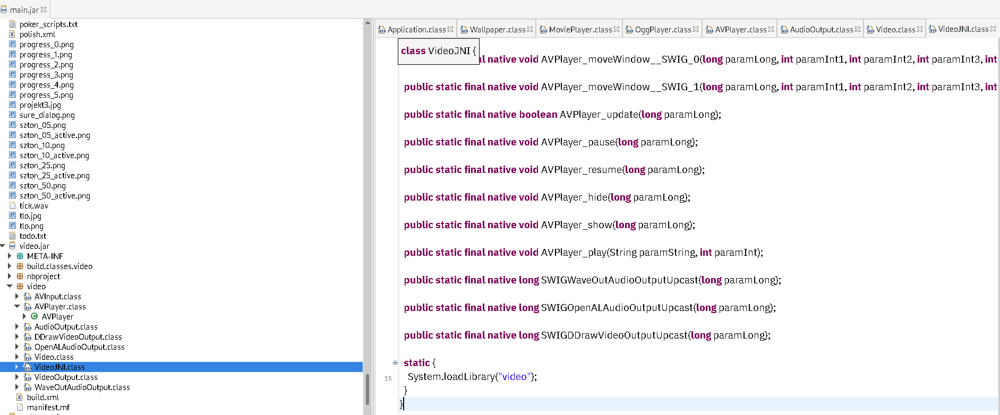

# Introduction

A couple of days ago I recalled this old adult game I used to play when I was teen.
It took me a few minutes of googling to find the name of the game: All Star Strip Poker.
Game from 2006 with lots of nice imagery and videos.

I wanted to buy this game again but unfortunately I could not find official website or any vendor that sells this game, so in the end I had to download ISO from a website that provides CD/DVD images for abaddonware.

# First try

I mounted ISO image on my Linux machine and installed it via Wine. It all went smooth with no issues.
But, when I ran the game, I could see only black screen with background music playing. And after a minute or so, game loaded, but this time with an error message saying that no DVD was inserted.


It's a basic protection mechanism of games made in 90ties and early 2000 to ensure that you really own hard copy of a game.

So, I started to dig into all this stuff.

# Analysis

Tools used for RE the game:
- Java Decompiler `jd-gui` for decompilation of main.jar - java part of the game
- Ghidra for static analysis
- x64dbg running under wine on Linux for dynamic analysis

Conceptual architecture of the game:

1. game is started via `start.exe`, which in return loads `main.jar` in Java Virtual Machine and executes it (`JNI_CreateJavaVM`)


2. `main.jar` contains all game logic and performs load of all app/video/sound data and settings


3. other two important parts of the game are `wallpaper.dll` and `video.dll` but more on them later


## DVD check

First goal is to find part of code that performs DVD check.

In `Init` method of `Application.Class` in `build.classes.game_poker` package, you can find CD check function call with argument `spoker`.


Function `Wallpaper.checkCD` is imported from `wallpaper.dll`


If we load `wallpaper.dll` in Ghidra, we can see it exports 3 functions:

- `_Java_wallpaper_Wallpaper_checkCD`
- `_Java_wallpaper_Wallpaper_createAppDataFolder`
- `_Java_wallpaper_Wallpaper_setWallpaper`

First function is of our interest.

Basically, at runtime when game `main.jar` is loaded in JVM by `start.exe`, it calls checkCD function with hardcoded string argument `spoker`.
This function then loops through all CD/DVD devices for label `spoker` and if it does finds it, then it enables play, otherwise it shows the error message.
So, it's a very weak mechanism to ensure that game DVD is loaded based only on checking DVD label without performing any checks on actual data on DVD.

Unfortunately, I could not set CD/DVD label in wine, so I had to patch the dll.
I loaded `start.exe` in x64dbg (32-bit version) and put a breakpoint on dll module `wallpaper.dll`.


I located function `checkCD` and changed the conditional jump to unconditional jump `jmp`.


In order to save the patch go to File -> Patch File and apply changes.
Rename/Delete old wallpaper.dll and save the patched one.

Start game again and we won't have issue with no DVD found.

# Gameplay = 0

Unfortunately, when I clicked play, videos of girls would not load but I could see cards. It's a linux/wine thing, so I postponed the bug analysis for other time.

# Decrypt movie files

On the other hand, I wanted to play videos from `data` folder which contains .avi files, presumably beautiful poker girls, but the files would not play.

They did not contain standard AVI format or any other format I'm familiar with - which means they are obsfucated or crypted data.

I went through all java decompiled code, start.exe code and wallpaper code but couldn't find crypt/decrypt function, except this little piece of code in `PlayMovie` method.


This looks like weird notation for xor encryption, but I needed to find place where it's interpreted and used.

Fast forward, I investigated `VideoJNI` class and correspondent dll `video.dll`.



Function that performs extraction of a hardcoded key `0xFF` passed from `PlayMovie` method, and then decryption of data with the key, is shown in the picture bellow:


So, after I got all these facts straight, writing a decryptor for movies was trivial, and I gave it a shot in Guile scheme. Script can be invoked `./all-star-strip-poker-decrypt.scm *` in `data` folder, after decryption output files will contain original filename and `out` suffix.

`all-star-strip-poker-decrypt.scm`

```
#!/usr/bin/guile \
--no-auto-compile -e main -s 
!#

(use-modules (ice-9 binary-ports))
;(use-modules (ice-9 format))

(define (poker-decrypt-avi file)
    (let* ((rport (open-file file "rb"))
	    (wport (open-file (string-append file "out") "wb")))
	(let loop ((byte (get-u8 rport)))
	    (if (not (eof-object? byte))
		(begin 
		    (put-u8 wport (logxor byte #xff))
		    (loop (get-u8 rport))))))) 

(define (main args)
  (map poker-decrypt-avi (cdr args)))

;(define args '("a02.avi" "a03.avi" "credits.avi"))
;(main args)
;(display (command-line))
```


