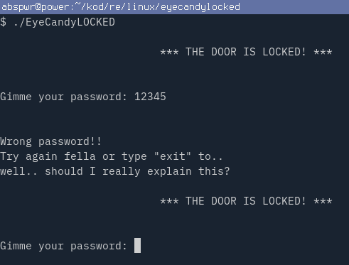
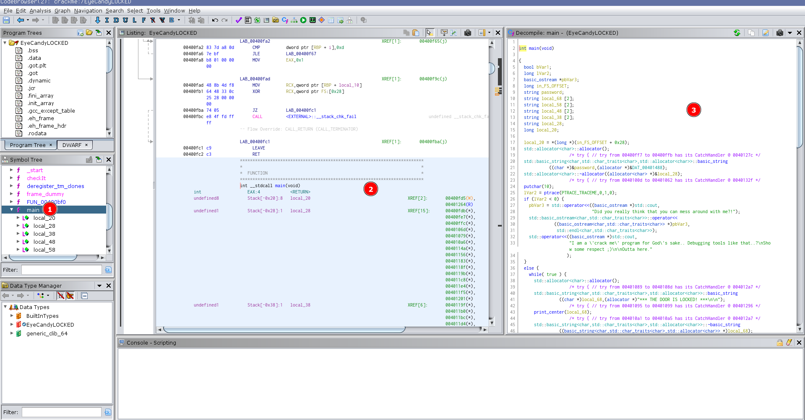
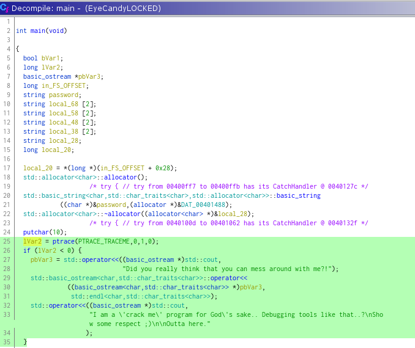
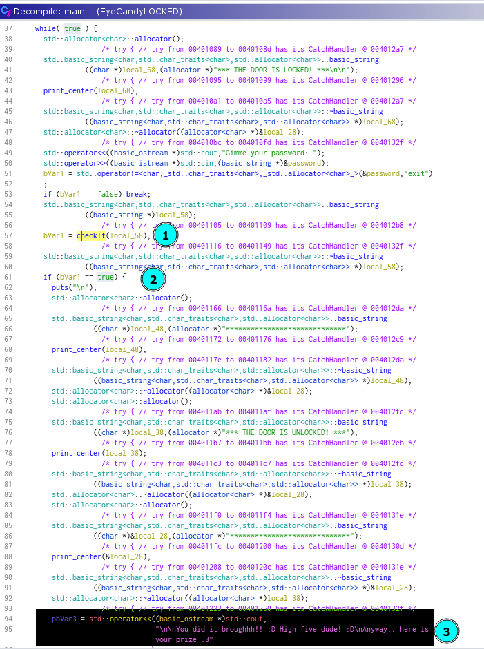
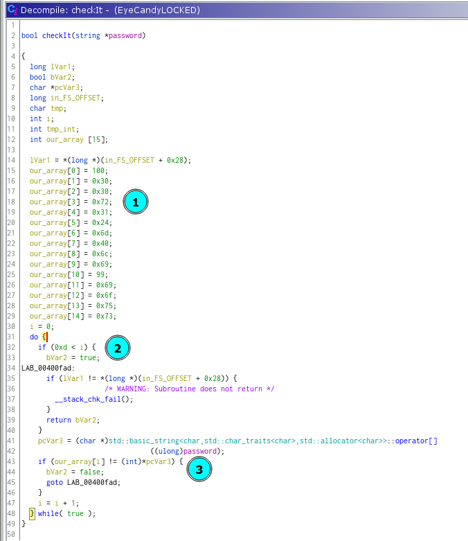
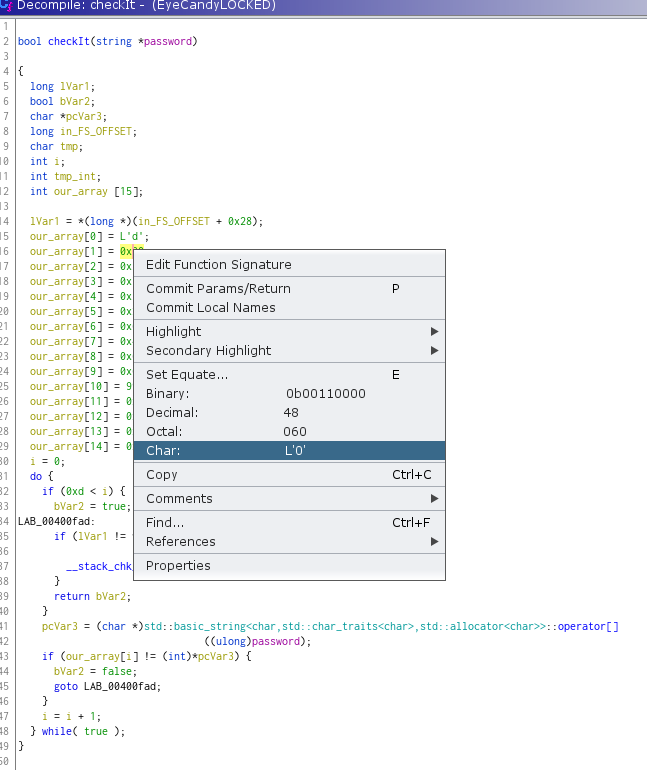
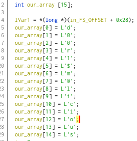
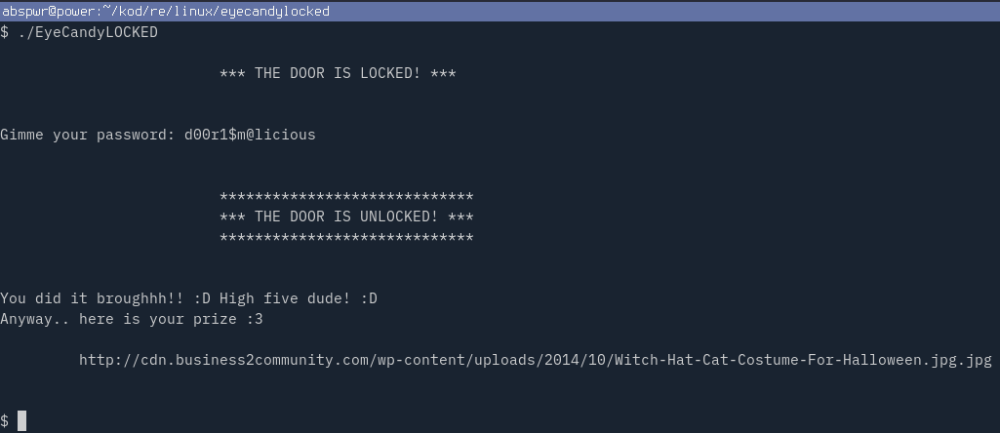

# EyeCandyLOCKED

Name: EyeCandyLOCKED

Author: nexy

URL: https://crackmes.one/crackme/5ab77f5b33c5d40ad448c563

Download: [here](./EyeCandyLOCKED)

Difficulty: 1

Quality: 1

Goal: find the key

Method: static analysis

Tools used: Ghidra

Executable format: ELF

Arch: x86-64

MD5: `a9a7fc640c4c1094c186acd88a5784cc`

SHA256: `2faeccea90e0321498636e4f90862b72bd714b5c997f579bc7f26822750b4ede`


# Tutorial

Run the crackme with `./EyeCandyLOCKED` and enter random input




## Ghidra
1. locate and select `main` function in Symbol Tree 
2. we won't be using disassembly window for this crackme
3. rather, Ghidra's decompiler is more than enough, you can open it with `CTRL+E` 




There is a basic antitracing mechanism used in the main function, 



If you try to trace the crackme `strace ./EyeCandyLOCKED` you will receive following message:

```
Did you really think that you can mess around with me?!
I am a 'crack me' program for God's sake.. Debugging tools like that..?
Sho w some respect ;)

Outta here.
```

Function `print_center` is custom one used for text alignment and it's not of an interest to us for cracking the key.

Main function contains infinite `while` loop that performs input from stdin, and outputs corresponding message whether we entered correct key or not; or if we entered `exit` which then terminates the program.

Input string from stdin is stored in local_58 variable, and then it's passed to function `checkIt` which compares the input to the key, and based on its return value, prints the good or badboy message.



Select `checkIt` function and press `ENTER` to see its definition.
Here, we see an already initialized array `out_array` with certain values, and loop that goes from 0 to 0xd (dec: 13) and compares our input (pcVar3 - passed password) to `out_array`.



To make things easier, we can convert the values of `out_array` to char. Select the literal hex value, right click and choose `Char:` representation.



Do it for the all elements of the array, and the key will reveal.



Run the program and enter the key `d00r1$m@licious`.
