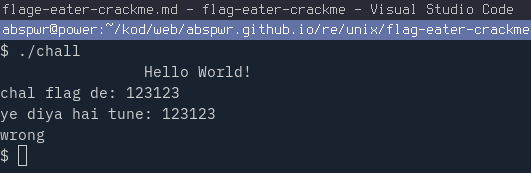
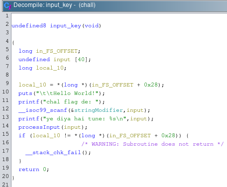
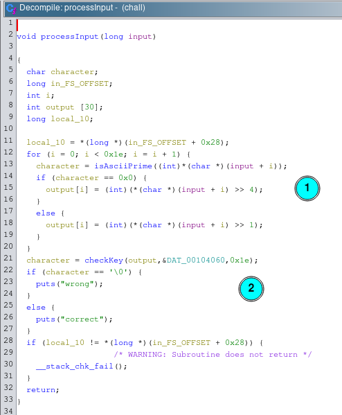
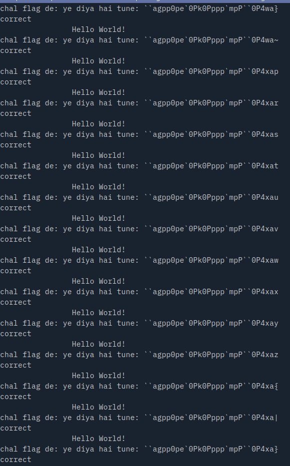

# flag_eater_crackme

Name: flag_eater_crackme 

Author: wh1t3r0se

URL: https://crackmes.one/crackme/61eec94433c5d413767ca64f

Download: [here](./chall)

Difficulty: 2

Quality: 2

Goal: keygen

Method: static analysis

Tools used: Ghidra

Executable format: ELF

Arch: x86-64

MD5: `1758c3822ed7268306b101283ebe9f2e`

SHA256: `34f539b0177f5cb178e908768ab84bb753408b3a451a53e951cb9bf08ce38197`

# Tutorial

Run crackme with `./chall` command:



I used Ghidra to perform static analysis. As always I renamed functions of our interest in Ghidra so it's easier to understand and follow.

First function that's called from `main` is `input_key(void)`.

It prints welcome message and ask for password from standard input.



Password is then forwarded to `processInput` function which in return checks the password and prints good/bad boy message.




First part of function is loop that goes through all 30 characters of input password and performs following operation:

- if ascii code of a password character is not a prime number then right shift by 4 (divide by 16) otherwise right shift by 1 (divide by 2), and store it in `output` array

`output` array is then checked via `checkKey` function that basically compares it to *magic array* bytes, and prints out correspondigly good/bad boy message.

I recreated the password generator in Guile (Scheme), a language I was trying to get hands on and learn for some time, so forgive me for some obvious mistakes.

There are in total 522080336425412505336307712 valid passwords for this crackme so I limited it to only first 1000 (which can be adjusted in the scheme script).

```
= 11 * 11 * 1 * 1 * 14 * 14 * 13 * 14 * 1 * 11 * 13 * 14 * 1 * 13 * 14 * 14 * 14 * 14 * 11 * 1 * 14 * 14 * 11 * 11 * 13 * 14 * 13 * 14 * 1 * 14 =  522080336425412505336307712
```

Without further do, you can find script [here](./chall-guile.scm).

Run it as `guile ./chall-guile.scm > keys.txt` to save passwords, and then feed it into crackme's standard input with shell command:

```sh
cat keys.txt | while IFS= read -r line; do echo "$line" | ./chall; done
```


