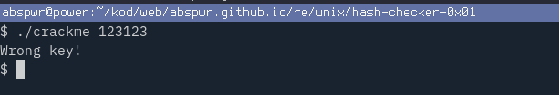
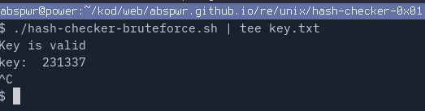
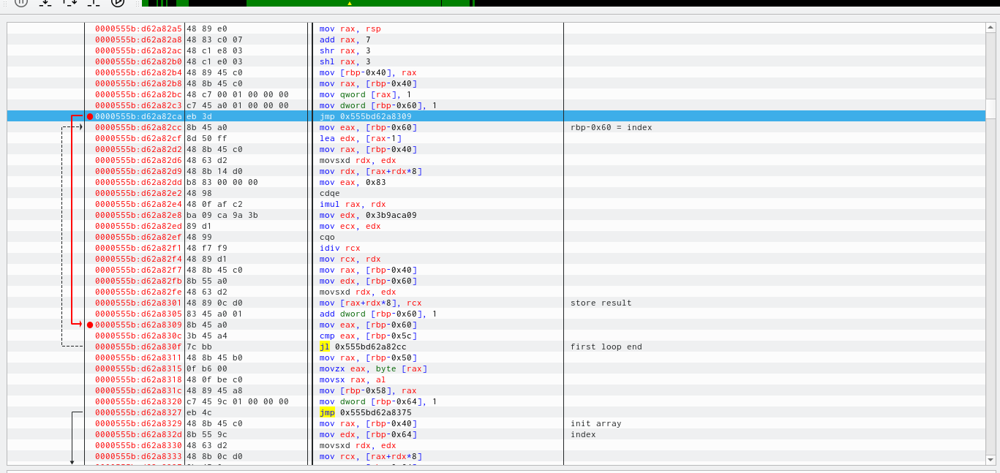
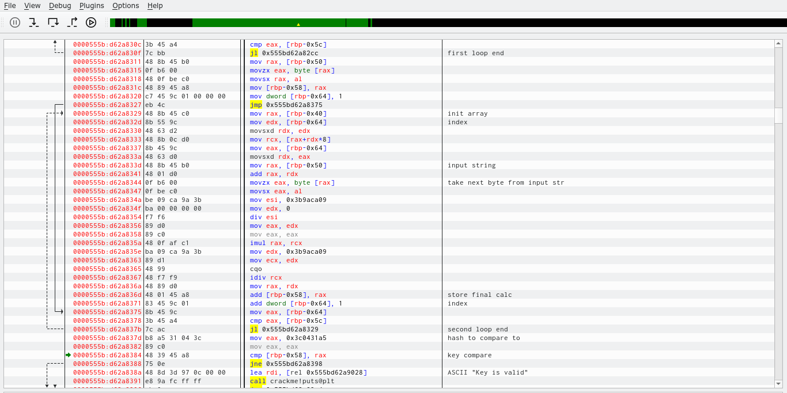

# Hash checker 0x01

Name: Hash checker 0x01

Author: f0rizen

URL: https://crackmes.one/crackme/622db5be33c5d46c8bcc027f

Download: [here](./crackme)

Difficulty: 1

Quality: 2

Goal: write a key generator

Method: static analysis

Tools used: Ghidra

Executable format: ELF

Arch: x86-64

MD5: `c211da76a03bf54bbc953ae5b1bbc457`

SHA256: `d69c34d6d961df2d8fcc6f2db74d566756efaad92ac9fac366422746ac5490d5`

# Tutorial

Run the crackme with `./crackme` and enter random input

## Ghidra

Import the crackme in Ghidra, and run it with standard analysis. 

Open the Ghidra decompiler with `CTRL+E` and rename the variables accordingly.

After some time of analysis, I chose the following names for variables.

~~~
undefined8 main(int argc,long argv)

{
  int isNum;
  size_t l;
  undefined8 uVar1;
  ulong halfLen;
  long in_FS_OFFSET;
  long params [2];
  int numParameter;
  int j;
  int i;
  int len;
  long hash;
  char *input;
  long unusedLen;
  long *initArr;
  long local_40;
  
  local_40 = *(long *)(in_FS_OFFSET + 0x28);
  params[1] = argv;
  numParameter = argc;
  if (argc == 2) {
    params[0] = 0x1011fb;
    l = strlen(*(char **)(argv + 8));
    if ((int)l == 6) {
      params[0] = 0x101213;
      isNum = checker(*(undefined8 *)(params[1] + 8));
      if (isNum != 0) {
        params[0] = 0x101240;
        l = strlen(*(char **)(params[1] + 8));
        len = (int)l;
        input = *(char **)(params[1] + 8);
        unusedLen = (long)len + -1;
        halfLen = ((long)len * 8 + 0xfU) / 0x10;
        initArr = params + halfLen * -2 + 1;
        *initArr = 1;
        for (i = 1; i < len; i = i + 1) {
          initArr[i] = (initArr[i + -1] * 0x83) % 0x3b9aca09;
        }
                    /* first char value from input */
        hash = (long)*input;
        for (j = 1; j < len; j = j + 1) {
          hash = hash + (long)(((ulong)(uint)(int)input[j] % 0x3b9aca09) * initArr[j]) % 0x3b9aca09;
        }
        if (hash == 0x3c0431a5) {
          params[halfLen * -2] = 0x101396;
          puts("Key is valid");
        }
        else {
          params[halfLen * -2] = 0x1013a4;
          puts("Wrong key!");
        }
        uVar1 = 0;
        goto LAB_001013a9;
      }
    }
  }
  params[0] = 0x101223;
  puts("Usage: ./crackme XXXXXX");
  uVar1 = 1;
LAB_001013a9:
  if (local_40 != *(long *)(in_FS_OFFSET + 0x28)) {
                    /* WARNING: Subroutine does not return */
    params[0] = 0x1013c0;
    __stack_chk_fail();
  }
  return uVar1;
}
~~~

Some of import points in this decompiled `main` function:

1. key must be equal to 6 symbols
2. key can contain only digits - check performed by `IsNum` function
3. first loop initializes a 6 element quadword array (64 bit) with magic values - constant values - first element value is 0x1
4. second loop performs mul/mod calculation between elements of `init` (magic array) and `input` array  - first element value is `input[0]`. Result of calculation is added to `hash` variable.
5. final `hash` value is compared to magic value `0x3c0431a5` and if it's true prints goodboy message

## Bruteforcing it with `sh`

Since a key is limited to 6 digit number, it's not a problem to bruteforce with a simple bourne shell script. It took a couple of minutes to find a key.
Loop starts from `100000` as the minimal 6 digit number, and tries all the numbers up to `1000000` grepping for goodboy message.
You can download the script [here](key.txt).

~~~
#!/bin/sh

i=100000
max=1000000

while [ $i -lt $max ]
do
	./crackme $i | grep "Key is valid" && echo "key: " $i

	i=`expr $i + 1`
done
~~~

There is only valid key for this challenge:

## Implementing Hash checker 0x1 in Go

Ghidra decompilation is of great help, so putting it together in Go was straightforward. You can download the code [here](./hash-checker-keygen.go)

~~~
package main

import (
	"fmt"
	"os"
	"strconv"
)

func isNum(input string) bool {
	_, err := strconv.Atoi(input)
	return err == nil
}

func main() {

	if len(os.Args) != 2 || len(os.Args[1]) != 6 || !isNum(os.Args[1]) {
		fmt.Println("Usage: ", os.Args[0], "xxxx")
		return
	}

	input := os.Args[1]

	//input := "231337"

	n := len(input)
	init := [6]uint64{1, 0, 0, 0, 0, 0}

	// initialize the rest of the magic values, these are always the same for init array
	// init := [6]uint64{0x1, 0x83, 0x4309, 0x224d9b, 0x118db651, 0x228a4e1d}
	for i := 1; i < n; i++ {
		init[i] = (init[i-1] * 0x83) % 0x3b9aca09
	}
	//fmt.Printf("init array: %x\n", init)

	hash := uint64(input[0])
	for j := 1; j < n; j++ {
		// hash = hash + (uint64(input[j])%0x3b9aca09)*init[j]%0x3b9aca09 // ghidra decompiler
		// remove unecessary mod and parentheses - simplify
		hash = hash + uint64(input[j])*init[j]%0x3b9aca09
	}
	//fmt.Printf("hash: %x\n", hash)

	if hash == 0x3c0431a5 {
		fmt.Println("Key is valid!")
	} else {
		fmt.Println("Wrong key!")
	}
}
~~~

## Dynamic analysis

It's been long time since I coded in assembly, or I worked in debugger with stripped binary.

Initially I went with gdb, radare2 -D, but ended up using edb debugger since it's the closest experience to OllyDbg on Windows, which I greatly admired and still have developed muscle memory for it.

Unfortunately, at the moment of writing it is possible not export comments, so I will dump screenshots in hope you will find it useful.

First loop - initialization array

Second loop - hash calculation - and check
