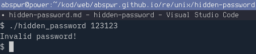
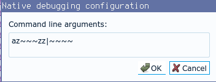
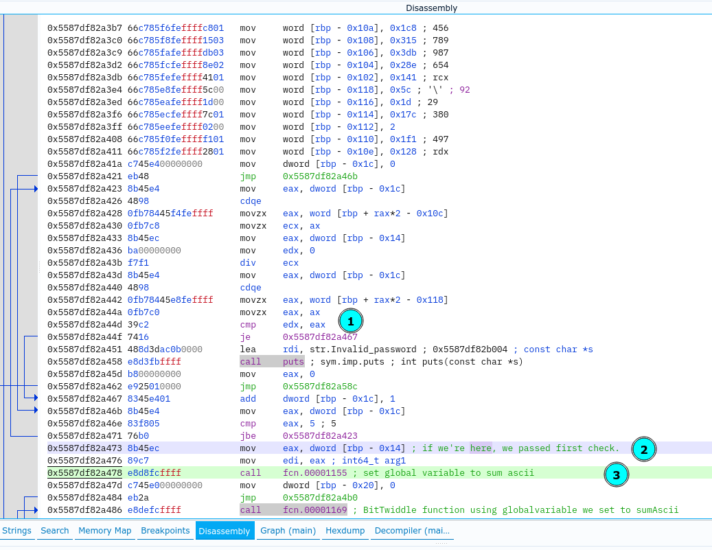
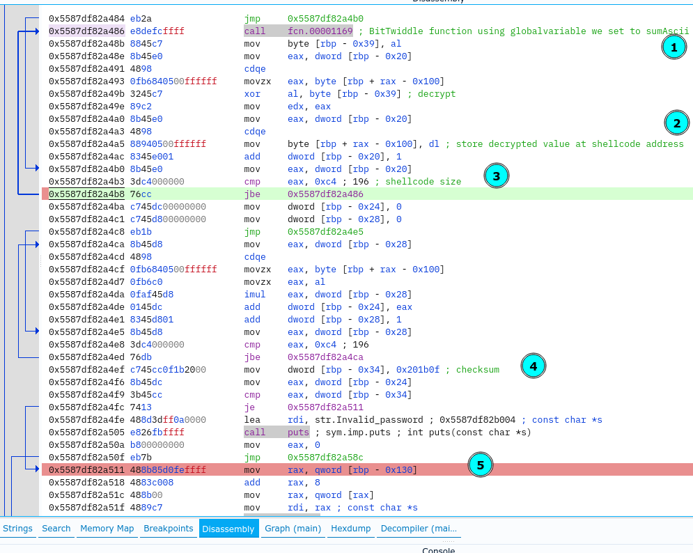
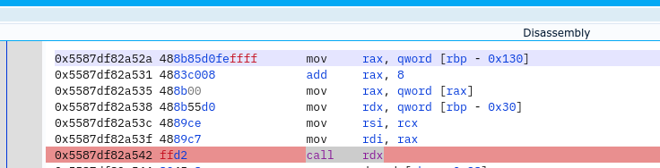
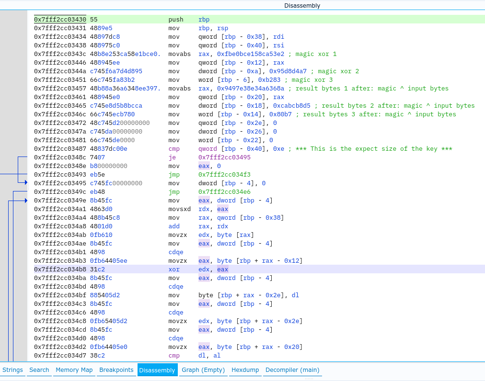

# Hidden password

Name: Hidden password

Author:  pjenik@seznam.cz

URL: https://crackmes.one/crackme/61ffb07c33c5d46c8bcbfc1d

Download: [here](./hidden_password)

Difficulty: 4

Quality: 4

Goal: find the key

Method: static analysis, dynamic analysis

Tools used: Ghidra, EDB, cutter

Executable format: ELF

Arch: x86-64

MD5: `25ee4131c9e19d19280e48e2bc2745d0`

SHA256: `d944813fd8e623a05072c2c866394f467b5ec1ff2352f037fe36466209fee838`

# Tutorial


Run the crackme with `./hidden_password` 



The crackme is very concise and straight to the point. It's not obsfucated and does not use antidebugging or antireversing methods. It's minimal and fits on two pages in Ghidra decompiler. 

I renamed some of variables and functions in Ghidra decompiler to make reversing easier.

~~~
undefined8 main(int argc,undefined8 *argv)

{
  size_t len;
  ulong j;
  ushort modArr [6];
  ushort divArr [6];
  undefined8 local_108;
  undefined8 local_100;
  undefined8 local_f8;
  undefined8 local_f0;
  undefined8 local_e8;
  undefined8 local_e0;
  undefined8 local_d8;
  undefined8 local_d0;
  undefined8 local_c8;
  undefined8 local_c0;
  undefined8 local_b8;
  undefined8 local_b0;
  undefined8 local_a8;
  undefined8 local_a0;
  undefined8 local_98;
  undefined8 local_90;
  undefined8 local_88;
  undefined8 local_80;
  undefined8 local_78;
  undefined8 local_70;
  undefined8 local_68;
  undefined8 local_60;
  undefined8 local_58;
  undefined8 local_50;
  undefined4 local_48;
  undefined local_44;
  byte xorVal;
  int local_40;
  undefined4 magicVal;
  undefined8 *shellcode;
  uint n;
  int local_2c;
  uint m;
  uint k;
  int i;
  uint sumAscii;
  
  local_108 = 0x28bf16683619a05b;
  local_100 = 0x4dd3ce3a2552e799;
  local_f8 = 0xa5ed9be182304449;
  local_f0 = 0x6e27e1473b191037;
  local_e8 = 0x6da9ec4e7ac0daec;
  local_e0 = 0x8929723c31c59039;
  local_d8 = 0xea92ac15de3c3f69;
  local_d0 = 0x828dd2f713f6e8be;
  local_c8 = 0xbb4d607b1c553c6f;
  local_c0 = 0x7dc2d2f3ec43ef5b;
  local_b8 = 0x4daf64150084dc96;
  local_b0 = 0xe1f1361e21c67ab9;
  local_a8 = 0xa4b498c90be95f82;
  local_a0 = 0xb439b94451f266b5;
  local_98 = 0x2380c814a4f0145b;
  local_90 = 0x808581a5b7fb9d7e;
  local_88 = 0x589b2b23881c5633;
  local_80 = 0xbbaa188d8cde35d8;
  local_78 = 0xf6f8fd3aeb6dd0d2;
  local_70 = 0x2feaa6b6ae8530b8;
  local_68 = 0xb30edc56b009e85f;
  local_60 = 0xfbd9e747ffc36c8f;
  local_58 = 0x18194f7045e8f66;
  local_50 = 0xc27b4d434fe8beea;
  local_48 = 0xcb87ceb3;
  local_44 = 0x26;
  shellcode = &local_108;
  if (argc == 2) {
    sumAscii = 0x7fffffff;
    for (i = 0; j = (ulong)i, len = strlen((char *)argv[1]), j < len; i = i + 1) {
      sumAscii = sumAscii + *(char *)((long)i + argv[1]) * i;
    }
    divArr[0] = 0x7b;
    divArr[1] = 0x1c8;
    divArr[2] = 0x315;
    divArr[3] = 0x3db;
    divArr[4] = 0x28e;
    divArr[5] = 0x141;
    modArr[0] = 0x5c;
    modArr[1] = 0x1d;
    modArr[2] = 0x17c;
    modArr[3] = 2;
    modArr[4] = 0x1f1;
    modArr[5] = 0x128;
    for (k = 0; k < 6; k = k + 1) {
      if (sumAscii % (uint)divArr[(int)k] != (uint)modArr[(int)k]) {
        puts("Invalid password!");
        return 0;
      }
    }
    setGlobalVar(sumAscii);
    for (m = 0; m < 0xc5; m = m + 1) {
      xorVal = BitTwiddle();
      *(byte *)((long)&local_108 + (long)(int)m) =
           *(byte *)((long)&local_108 + (long)(int)m) ^ xorVal;
    }
    local_2c = 0;
    for (n = 0; n < 0xc5; n = n + 1) {
      local_2c = local_2c + *(byte *)((long)&local_108 + (long)(int)n) * n;
    }
    magicVal = 0x201b0f;
    if (local_2c != 0x201b0f) {
      puts("Invalid password!");
      return 0;
    }
    len = strlen((char *)argv[1]);
    local_40 = (*(code *)shellcode)(argv[1],len);
    if (local_40 == 0) {
      puts("Invalid password!");
    }
    else {
      puts("Good password!");
    }
  }
  else {
    printf("Usage: %s <password>\n",*argv);
  }
  return 1;
}
~~~

We can divide crackme in three sections:
1. modular arithmetic check (loops 1 and loop 2) 
2. shellcode decryptor and checksum check - 0x201b0f (loop3 and loop4)
3. shellcode execution itself after it's decrypted and run entirely on stack

The crackme starts with with a loop which sums all of the input ascii values, each multiplied by index `i` value at the time. Index goes from 0 to length of input string.
Right on, we see that first character is irrelevant, since the index is zero and multiplication of any value with zero always evaluates to zero, so it won't affect the total sum of ascii values multiplied by index. Keep this in mind later on.

~~~
sumAscii = 0x7fffffff;
for (i = 0; j = (ulong)i, len = strlen((char *)argv[1]), j < len; i = i + 1) {
    sumAscii = sumAscii + *(char *)((long)i + argv[1]) * i;
}
~~~

Second loop performs 6 modular arithmetic checks - each of them is known and predefined: `sumAscii mod divArr[k] == modArr[k]`?

~~~
divArr[0] = 0x7b;
divArr[1] = 0x1c8;
divArr[2] = 0x315;
divArr[3] = 0x3db;
divArr[4] = 0x28e;
divArr[5] = 0x141;
modArr[0] = 0x5c;
modArr[1] = 0x1d;
modArr[2] = 0x17c;
modArr[3] = 2;
modArr[4] = 0x1f1;
modArr[5] = 0x128;
for (k = 0; k < 6; k = k + 1) {
    if (sumAscii % (uint)divArr[(int)k] != (uint)modArr[(int)k]) {
    puts("Invalid password!");
    return 0;
    }
}
~~~

Initially, I was thinking of bruteforcing the number that, when divided by `divArr` provide remainders contained in `modArr`. But, I went with easier approach [congruences](https://en.wikipedia.org/wiki/Modular_arithmetic) - precisely [Chinese Remainder Theorem](https://en.wikipedia.org/wiki/Chinese_remainder_theorem). In short, given remainders and divisors, we can find the number n - sumAscii.
I looked online for CRT calculators - solvers, and all the one I checked were coded for system of congruences with coprime divisors - **no two divisors share a common factor other than 1** - which is not the case with divisors in this crackme.

Then, I found [CRT solver](https://github.com/ZeroBone/chrem) on github which also works for no-coprime divisors, and was really curious to see what's the value of `sumAscii`.
I imported the CRT solver in my python working file and called it with div and mod values contained in crackme:

~~~
divArr = list(range(6))
divArr[0] = 0x007b; # 123
divArr[1] = 0x01c8; # 456
divArr[2] = 0x0315; # 789
divArr[3] = 0x03db; # 987
divArr[4] = 0x028e; # 643
divArr[5] = 0x0141; # 321

modArr = list(range(6))
modArr[0] = 0x005c; # 92
modArr[1] = 0x001d; # 29
modArr[2] = 0x017c; # 380
modArr[3] = 0x0002; # 2
modArr[4] = 0x01f1; # 497
modArr[5] = 0x0128; # 296

import chrem

congruences = []
congruences.append((modArr[0], divArr[0]))
congruences.append((modArr[1], divArr[1]))
congruences.append((modArr[2], divArr[2]))
congruences.append((modArr[3], divArr[3]))
congruences.append((modArr[4], divArr[4]))
congruences.append((modArr[5], divArr[5]))
cgrSolution = chrem.chrem_multiple(congruences)
print("magic:", hex(cgrSolution[0]))
~~~

```
magic: 0x8000203d
```

The magic number of sumAscii that passes the first check is 0x8000203d.

But how we find out which ascii characters and how many of them will when multiplied by index, equal to the value of 0x8000203d.
I really didn't want to write bruteforce or some form of subset solution, so I went different way again.

I looked up for modern reverse engineering methods, tools, and libraries and came across [Z3 Theorem Prover](https://en.wikipedia.org/wiki/Z3_Theorem_Prover). 

It looked promising, as a couple of crackers showed its usefulness and practicality at solving some really challenging crypto crackmes. It works like a black box, where we set constraints, logical equations, which we add to Z3 solver, and wait for results. It either provides solution `sat` or not - `unsat` - which means the problem is not SAT solvable. 

After re-reading a couple of crackme writeups using Z3... many times, I came up with following code:

~~~
# the length of input - this one was bitch to find
maxInput = 0xe

solver = Solver()

# input array 
input = [BitVec('input%d'%i, 48) for i in range(maxInput)]

# I included all possible printable ascii values since i did not know what I was dealing with
minAscii = 32 
maxAscii = 126

# fixed value ascii sum is added up to
sumAscii = 0x7fffffff

def findTheNumber():
    global sumAscii

    exprSum = ""
    for i in range(1, maxInput):
        # constraint for ascii values
        solver.add(And(input[i] >= minAscii, input[i] <= maxAscii))

        # sum expression generator - as string - which we later evaluate
        exprSum += 'input[' + str(i) + '] * ' + str(i) + ' +'

    # generate equation for each of the divisors and mods
    exprFin0 = "(" + exprSum + str(sumAscii) + ") % divArr[0] == modArr[0]"
    exprFin1 = "(" + exprSum + str(sumAscii) + ") % divArr[1] == modArr[1]"
    exprFin2 = "(" + exprSum + str(sumAscii) + ") % divArr[2] == modArr[2]"
    exprFin3 = "(" + exprSum + str(sumAscii) + ") % divArr[3] == modArr[3]"
    exprFin4 = "(" + exprSum + str(sumAscii) + ") % divArr[4] == modArr[4]"
    exprFin5 = "(" + exprSum + str(sumAscii) + ") % divArr[5] == modArr[5]"

    # add to solver and evaluate
    solver.add(eval(exprFin0))
    solver.add(eval(exprFin1))
    solver.add(eval(exprFin2))
    solver.add(eval(exprFin3))
    solver.add(eval(exprFin4))
    solver.add(eval(exprFin5))

    # sat or unsat
    print(solver.check())

    # work through all solutions
    while solver.check() == sat:
        #print(solver.model())
        m = solver.model()
    
        key = ""
        magicSum = 0
    
        for i in range(1, maxInput):
    
            asciiVal = m[input[i]].as_long()
            key += chr(asciiVal)
            magicSum += asciiVal * i

        sumAscii += magicSum
    
        # this will give us the same asciiSum like the CRT method
        print(magicSum, key) # we need key to pass two checks and get to the shellcode

        break # take first that satisfy rule and break since there are too many of them, we just want to pass the first two check loops, decrypt shellcode and check the key logic there

~~~

Determining the length of input key took a couple of tries.  Setting `maxInput` bellow 0xc does not provide solutions - unsat. Length of input 0xc and above provides many solutions in `input` array. And they all sum up to 0x8000203d which satisfies the check in second loop.

So, I ran the script and took the first provided solution by Z3 solver.

~~~
z~~~zz|~~~~
~~~

This is definitely not our key xD, but it will help us proceed futher with dynamic analysis of the crackme.

Enter the key in debugger (cutter or edb), and don't forget to add extra ascii character at the beginning - placeholder. Without it our calculation in first loop will be incorrect. , I prefixed the key with character `a`.



I set the breakpoint behind second loop, and resume execution. The input string we retrieved by using Z3 passed all modulo checks (loop2).



Proceed executing up to third loop, where the decryption of shellcode occurs. The decryption mechanism relies on `BitTwiddle` function which performs bit arithmetics on global variable set to `sumAscii`, it also changes the global variable every time it's called.
~~~
uint BitTwiddle(void)
{
  DAT_00104040 = DAT_00104040 * 0x41c64e6d + 0x3039;
  return (uint)((ulong)DAT_00104040 >> 0x10) & 0x7fff;
}
~~~
Return value of `BitTwiddle` is used as xor decryption key of the shellcode.
Fourth loop does checksum of shellcode.



Our key passed the checksum validation, so we proceed executing till the call to shellcode.


I stepped into shellcode and what we see at the beginning is that the key size must be 0xe, not 0xc as we used above. Also, the input key is xored with magic xor bytes (0xe in total) and result is compared to result array of bytes (also 0xe in size), which means there is only one key for this crackme.



I extracted the magic and result bytes in python and performed the xor calculation to get the key.
~~~
# xor and comparison bytes retrieved from the shellcode
result = [0x8a, 0x36, 0xa6, 0x34, 0x8e, 0xe3, 0x97, 0x94,   0xa7, 0xd4, 0xd8, 0x95,   0x83, 0xb2]
xorVals = [0xe2, 0x53, 0xca, 0x58, 0xe1, 0xbc, 0xe0, 0xfb,  0xd5, 0xb8, 0xbc, 0xca,   0xb7, 0x80]

# get the key
pwd = list(x ^ y for x, y in zip(xorVals,result))
print("key:", "".join([chr(x) for x in pwd]))
~~~

Output:
~~~
key: hello_world_42
~~~

You can check source code of my python workfile [here](./hidden-password-crack.py). 