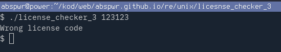
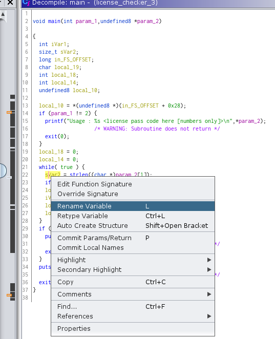
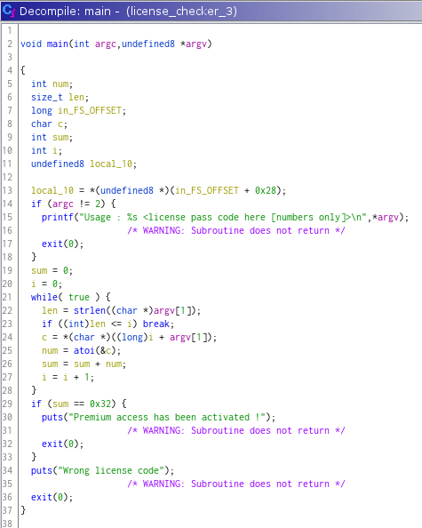

# licesnse_checker_3

Name: licesnse_checker_3

Author: pourmeadrinkwhileimfloating

URL: https://crackmes.one/crackme/62327b0433c5d46c8bcc0335

Download: [here](./license_checker_3)

Difficulty: 1

Quality: 1

Goal: write a key generator

Method: static analysis

Tools used: Ghidra

Executable format: ELF

Arch: x86-64

MD5: `792dff81ac2d2b3e3d3e6c094fc0f1e5`

SHA256: `29412589df288184ca00159c8275e8218a5d103899cf63954edd97b6c931c2eb`

# Tutorial

Run the crackme with `./license_checker_3 123123` and enter random input



## Ghidra

Open Decompile window with `CTRL+E` shortcut.

key check is performed in `main` function.

Rename variables to make analysis easier. Right click on variable and change its name accordingly.



So it makes more sense, like bellow. 



Immediately, we can see that key check is performed in single while loop in main.
Loop is executed `len` times depending on number of characters in a string we passed via `argv[1]`.
Each of single characters is converted to an int value via `atoi` function and it's added to `sum` variable.

After the loop finishes, `sum` variable is compared to `0x32` value (dec. 50), and if it's true, good boy message is printed.

There is no restriction to length of passed string, so we both `5555555555` and `8888855` are valid keys, since they both add up to 50.

`atoi` function returns `0` for a nonnumeric character, so the key `88a88.8x55` will work as well.

Naive brute-force key generator can be found [here](license_checker_3-key-generator-brute.go).

```
// abspwr
package main

import (
	"fmt"
	"math"
)

func sumDigs(n uint64) uint64 {
	if n == 0 {
		return 0
	} else {
		return n%10 + sumDigs(n/10)
	}
}

func printDigs(n uint64) {
	if n == 0 {
		fmt.Println()
	} else {
		printDigs(n / 10)
		fmt.Print(n % 10)
	}
}

func main() {
	n := 6
	t := uint64(0x32) // 50
	max := uint64(math.Pow10(n))
	i := uint64(0)

	for i = 1; i < max; i++ {
		if sumDigs(i) == t {
			printDigs(i)
		}
	}
}
˙``
